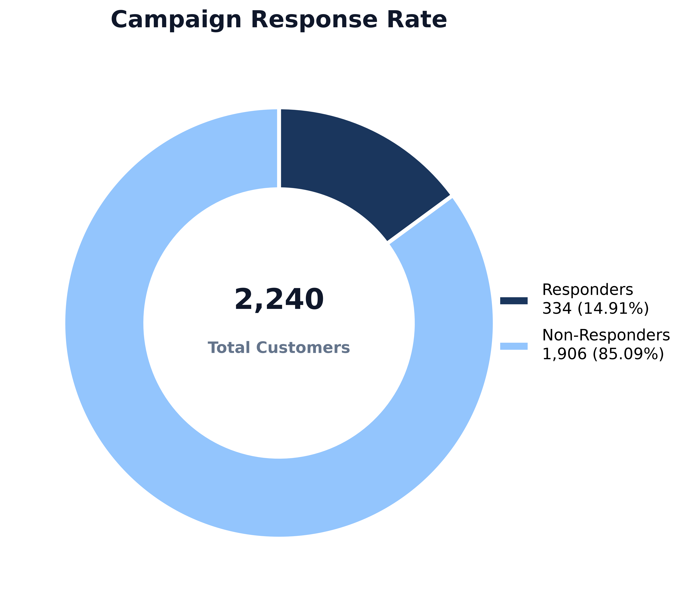
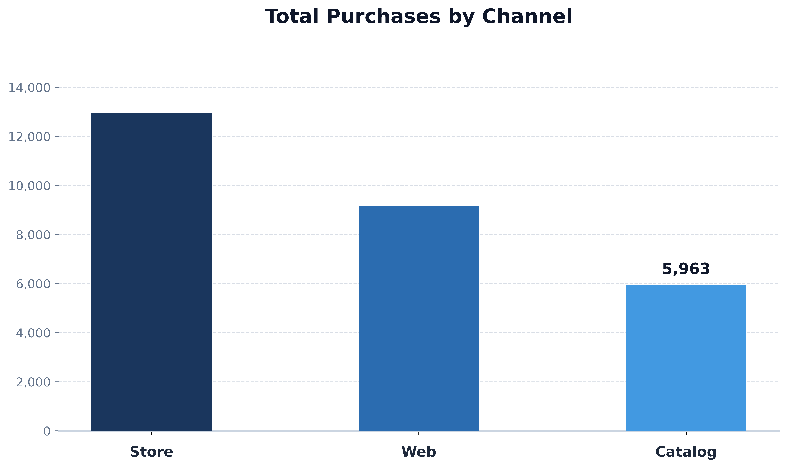
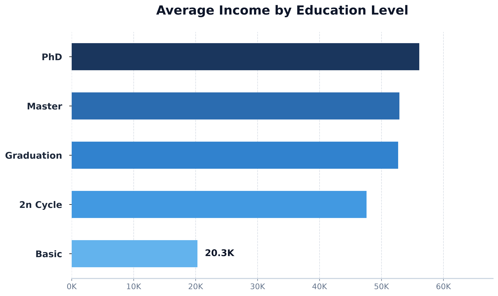
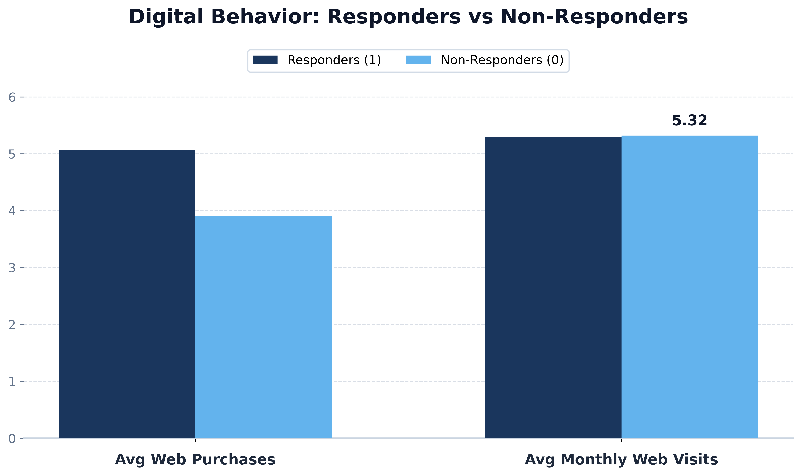
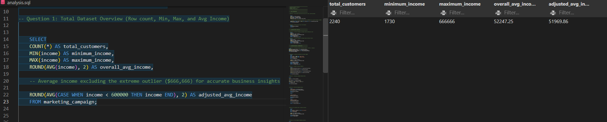
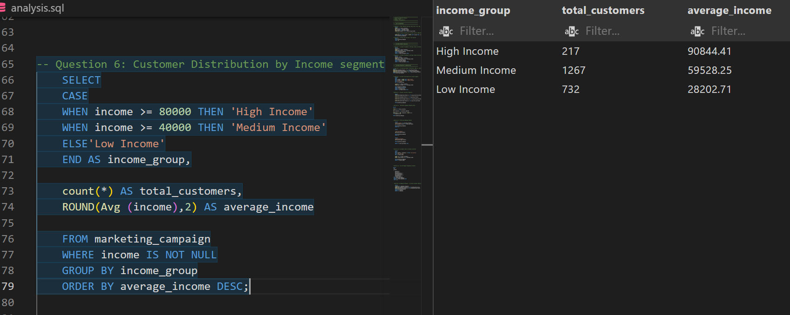
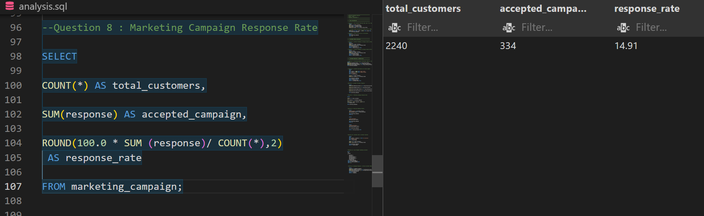
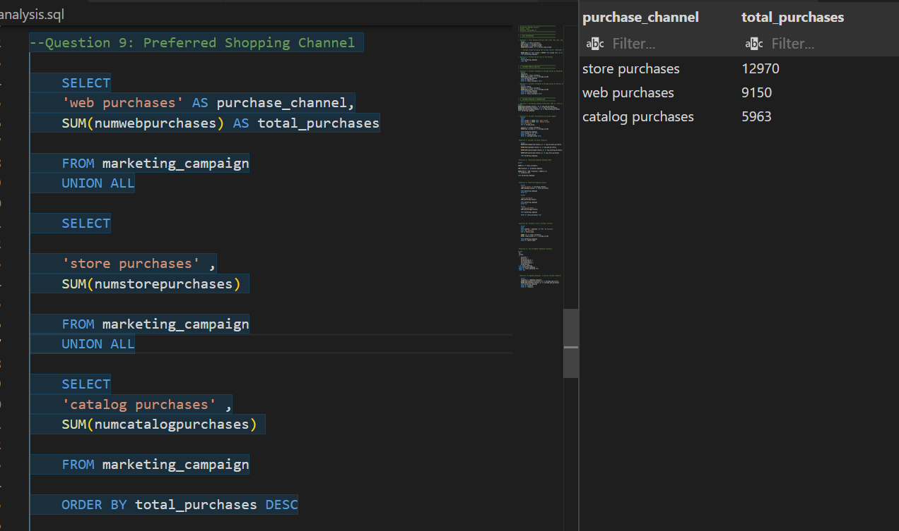
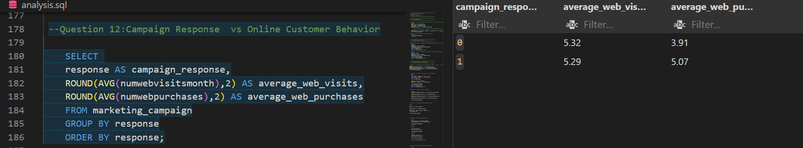

# Marketing Campaign & Customer Behavior SQL Analysis

## Project Overview

This project analyzes customer and marketing campaign data using SQL to identify customer behavior, campaign performance, purchasing patterns, and opportunities for business improvement.

The analysis focuses on turning raw customer data into actionable business insights.

## Business Questions

The analysis explores:

- What factors are associated with campaign response?
- Which purchasing channels generate the most purchases?
- How do income and demographics vary across customer segments?
- What characterizes high-value customers?
- How does digital behavior relate to campaign response?
- Which customer segments present opportunities for targeted marketing?

## Tools & Technologies

- SQL (PostgreSQL & pgAdmin)
- Python (Matplotlib & NumPy for High-Res Visualizations)
- Visual Studio Code & Git/GitHub

## Key Findings

- Campaign response rate was **14.91%** (334 of 2,240 customers).
- Store purchases were the highest (**12,970**), followed by Web (**9,150**) and Catalog (**5,963**).
- Medium-income customers represented the largest segment (**1,267 customers**).
- Campaign responders averaged **5.07 web purchases** compared with **3.91** for non-responders.
- Responders and non-responders had similar average monthly web visits (**5.29 vs. 5.32**).

See [`findings.md`](findings.md) for the complete set of key insights.

## Key Visualizations

| Campaign Response Rate | Total Purchases by Channel |
| :---: | :---: |
|  |  |

| Income by Education Level | Digital Behavior Analysis |
| :---: | :---: |
|  |  |

## Recommendations

The analysis suggests focusing on:

- Improving campaign targeting using customer characteristics and purchasing behavior.
- Exploring digital conversion opportunities through personalized offers and targeted campaigns.
- Prioritizing high-value customers through retention strategies.
- Optimizing channel strategy by maintaining the store channel as a core sales channel while exploring opportunities to increase web and catalog purchases.

See [`recommendations.md`](recommendations.md) for the detailed recommendations.

## SQL Query Screenshots

### Q1 — Total Dataset Overview


### Q6 — Customer Distribution by Income Segment


### Q8 — Campaign Response Rate


### Q9 — Total Purchases by Channel


### Q12 — Campaign Response vs Online Behavior


## Project Structure

```text
SQL_PROJECT_ANALYSIS/
│
├── Data/
│ └── marketing_campaign.csv
├── schema/
│ └── schema_diagram.png
├── screenshots/
├── visualizations/
│
├── analysis.sql
├── create_table.sql
├── findings.md
├── generate_charts.py
├── import_data.sql
├── README.md
└── recommendations.md